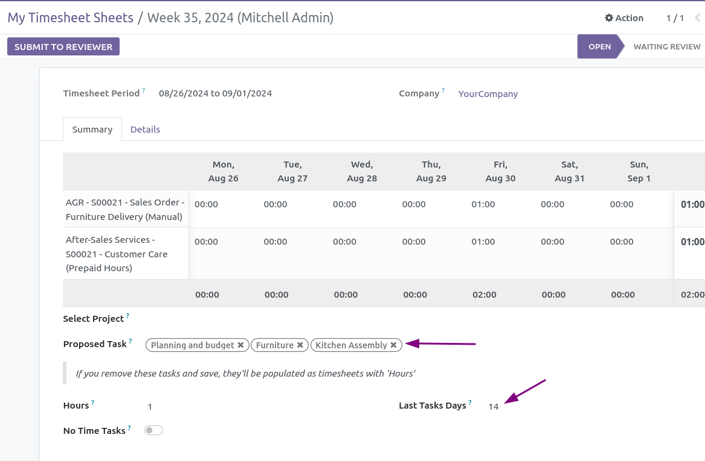

Add a field to select tasks among last used timesheet ones

Here is `Timesheet candidates` field display tasks on which you recorded time recently.

This module is especially useful when your week timesheet is empty and you have worked on same tasks than previous week.

Your timesheet tasks from last 14 days are suggested to be added to the timesheet
