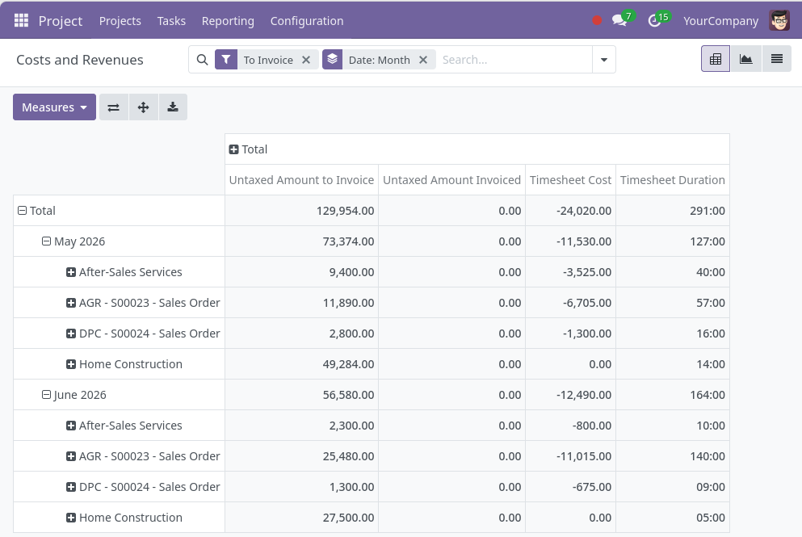

## View

## Columns

| Column | Meaning |
|---|---|
| Timesheet Duration | hours logged on the timesheet |
| Timesheet Cost | cost of that time (shown negative) |
| Untaxed Amount to Invoice | billable value of time **not yet** invoiced |
| Untaxed Amount Invoiced | billable value of time **already** invoiced |

The billable value of a timesheet is its duration — converted into the sale
order line's unit of measure — times the line's unit price, less the line
discount. It counts as *to invoice* until the timesheet is linked to an
invoice, after which it counts as *invoiced*.

## Using the report

The report opens under **Project → Reporting → Timesheet Costs and Revenues**, grouped by
month, with the **To Invoice** filter on by default so you only see periods that
still have unbilled time. Clear that filter to see everything, switch on
**Invoiced** to review what has been billed, and use **Group By** to slice by
project, customer, sale order, analytic account, product, and more.

## Assumptions

- This is a **time-and-material** report: revenue is only counted for sale order
  lines whose delivered quantity comes from timesheets. Fixed-price and
  milestone lines still contribute cost and hours, but no revenue.
- A **single currency** is assumed — the sale price and timesheet cost are used
  as-is, with no conversion.
- **Invoiced** is the same calculation as **to invoice**, flipped once a
  timesheet is linked to an invoice. It is not read back from the posted invoice
  line, so it can differ if a price changed or an invoice was edited afterwards.
